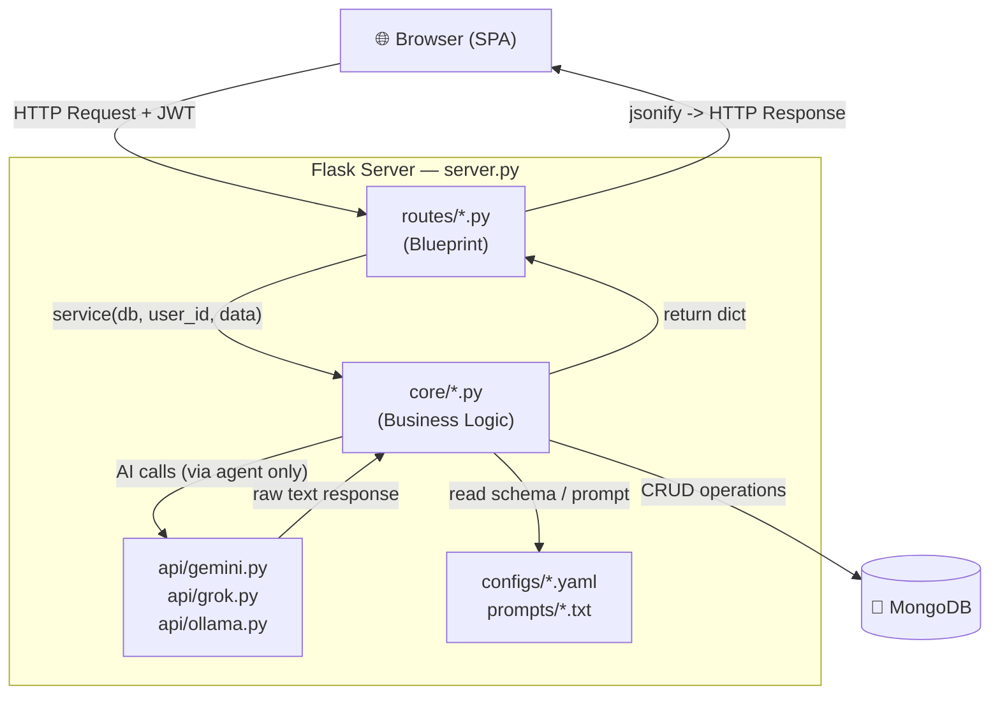
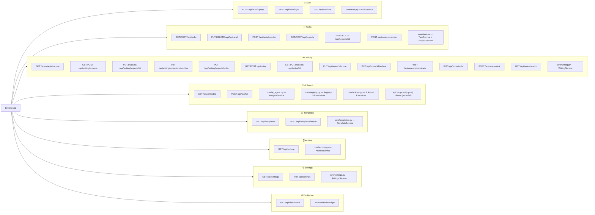
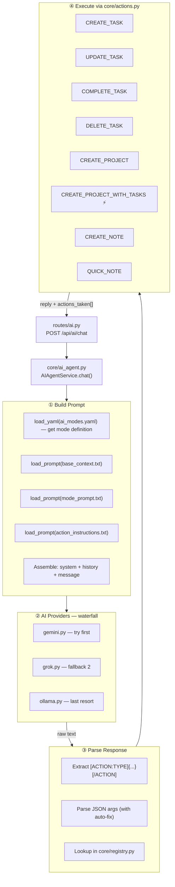
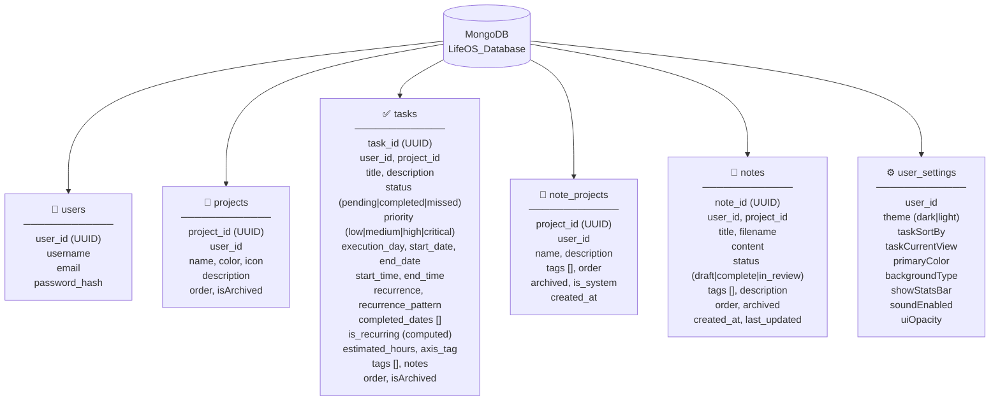
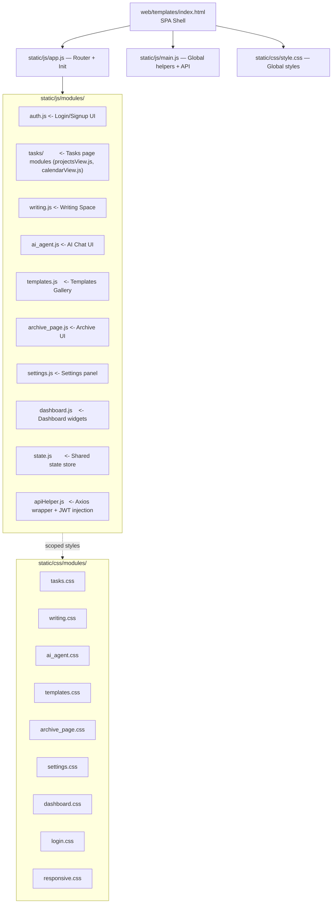

# 🗺️ LifeOS — Project Mind Map

> A comprehensive map of all application components. Updated with every structural change.
> **Last updated:** 2026-04-26 | **Version:** V1.0

---

## 1. 🌳 Folder Tree

```
My_App/
├── server.py              <- Application entry point (Flask app + DB connection)
├── requirements.txt       <- Python dependencies
├── README.md              <- Full project documentation
├── deploy.bat             <- GitHub deploy script
├── .env                   <- Secret environment variables (never committed)
│
├── api/                   <- External AI connectors (HTTP only, no Flask)
│   ├── __init__.py
│   ├── gemini.py          <- Google Gemini API
│   ├── grok.py            <- xAI Grok API
│   └── ollama.py          <- Ollama local LLM
│
├── core/                  <- Business Logic (knows nothing about HTTP or Flask)
│   ├── __init__.py
│   ├── actions.py         <- Action executors (CREATE_TASK, CREATE_PROJECT, ...)
│   ├── ai_agent.py        <- AI engine: prompt builder + action parser + executor
│   ├── archive.py         <- Archive service
│   ├── auth.py            <- Auth service (signup / login / validate)
│   ├── config_loader.py   <- YAML + TXT loader with in-memory caching
│   ├── registry.py        <- Action Registry infrastructure (decorator + dict + stats)
│   ├── schema_factory.py  <- Dynamic MongoDB document builder from YAML schemas
│   ├── settings.py        <- User settings service
│   ├── task.py            <- TaskService + ProjectService
│   ├── templates.py       <- Template import service
│   ├── utils.py           <- Shared helpers (serialize_datetime, serialize_doc)
│   └── writing.py         <- WritingService (notes + note projects)
│
├── routes/                <- Flask Blueprints (HTTP <-> core bridge)
│   ├── __init__.py
│   ├── ai.py              <- /api/ai/*
│   ├── archive.py         <- /api/archive
│   ├── auth.py            <- /api/auth/*
│   ├── dashboard.py       <- /api/dashboard
│   ├── settings.py        <- /api/settings
│   ├── tasks.py           <- /api/tasks, /api/projects
│   ├── templates.py       <- /api/templates
│   └── writing.py         <- /api/writing/*, /api/notes/*
│
├── configs/               <- YAML config files (no hardcoded values in Python)
│   ├── ai_modes.yaml      <- AI mode definitions (planning, coaching, tasks, productivity)
│   ├── app_config.yaml    <- App settings, defaults, life axes
│   ├── schemas.yaml       <- MongoDB entity schemas for every collection
│   └── templates.yaml     <- Built-in template definitions
│
├── prompts/               <- AI System Prompts (text files, not hardcoded)
│   ├── base_context.txt       <- Base context (UTC time, identity)
│   ├── action_instructions.txt<- Action tag instructions for the AI
│   ├── planning.txt           <- Planning mode system prompt
│   ├── coaching.txt           <- Coaching mode system prompt
│   ├── productivity.txt       <- Productivity mode system prompt
│   └── tasks.txt              <- Tasks mode system prompt
│
└── web/                   <- Frontend (SPA — Single Page Application)
    ├── templates/
    │   ├── index.html         <- SPA shell
    │   └── components/        <- HTML partials
    └── static/
        ├── css/
        │   ├── style.css          <- Global styles
        │   └── modules/           <- Per-page CSS modules
        └── js/
            ├── app.js             <- Router + Init
            ├── main.js            <- Global helpers + API layer
            └── modules/           <- Per-feature JavaScript modules
```

---

## 2. 🔄 Request Data Flow



---

## 3. 🧩 Feature Map



---

## 4. 🤖 AI System — Action Registry Flow



---

## 5. 🗃️ Database — Collections



---

## 6. 🖥️ Frontend (SPA Architecture)



---

## 7. 🔑 Environment Variables (.env)

| Variable | Description | Required |
|---|---|---|
| `MONGO_URI` | MongoDB connection string | ✅ |
| `MONGO_DB_NAME` | Database name (default: `LifeOS_Database`) | Optional |
| `JWT_SECRET_KEY` | JWT signing secret (any long random string) | ✅ |
| `AI_PROVIDER` | `gemini` / `ollama` / `grok` (default: `gemini`) | Optional |
| `GEMINI_API_KEY` | Required when `AI_PROVIDER=gemini` | Conditional |
| `GROK_API_KEY` | Required when `AI_PROVIDER=grok` | Conditional |
| `CORS_ORIGINS` | Allowed origins whitelist (CSV) | Optional |
| `FLASK_ENV` | Set to `development` to enable debug logging | Optional |

---

## 8. 🤖 Available AI Actions

| Action | Purpose | Required Fields |
|---|---|---|
| `CREATE_TASK` | Create a task (with smart project name resolution) | `title` |
| `UPDATE_TASK` | Update any field on an existing task | `task_id` |
| `COMPLETE_TASK` | Mark a task as completed | `task_id` |
| `DELETE_TASK` | Delete a task permanently | `task_id` |
| `CREATE_PROJECT` | Create a new project | `name` |
| `CREATE_PROJECT_WITH_TASKS` ⚡ | Project + all tasks in one shot | `name`, `tasks[]` |
| `CREATE_NOTE` | Create a note in Writing | `title` |
| `QUICK_NOTE` | Append text to QuickNote.txt | `content` |

---

## 9. ✅ Changelog

### V1.2 — 2026-05-01 (Calendar & Time Blocking)

| Change | File | Type |
|---|---|---|
| Replace daily/monthly views with Notion-style FullCalendar | `tasks.html`, `tasks.css`, `index.js` | ✨ New |
| Implement Time Blocking view (`timeGridWeek`) | `calendarView.js` | ✨ New |
| Add `start_time` and `end_time` to tasks | `schemas.yaml`, `modal.js` | ✨ Enhancement |
| Remove legacy views | `dailyView.js`, `monthlyView.js` | 🗑️ Delete |
| Support dynamic date ranges (`window_start`, `window_end`) | `core/task.py`, `routes/tasks.py` | ⚡ Perf |
| Filter unscheduled tasks from Today's Focus | `routes/dashboard.py` | 🐛 Fix |

### V1.1 — 2026-04-29 (Writing Space Overhaul)

| Change | File | Type |
|---|---|---|
| B1: Fix sort bug — serialize datetimes AFTER sorting in `get_structure()` | `core/writing.py` | 🐛 Fix |
| B2: Add filename collision check in `update_note()` on rename | `core/writing.py` | 🐛 Fix |
| B3: Add filename collision check in `move_note()` | `core/writing.py` | 🐛 Fix |
| B4: `save_quick_note()` first creation uses `build_document` | `core/writing.py` | 🐛 Fix |
| P1: Replace N+1 queries with aggregation in `get_projects()` | `core/writing.py` | ⚡ Perf |
| P2+P3: Replace N writes with `bulk_write` in reorder methods | `core/writing.py` | ⚡ Perf |
| Q1: `get_notes()` supports `?search=`, `?status=`, `?archived=` | `core/writing.py`, `routes/writing.py` | ✨ Enhancement |
| Q2: `update_note()` validates non-empty title after strip | `core/writing.py` | 🐛 Fix |
| F1: Word count + reading time in `get_note()` / `update_note()` | `core/writing.py` | ✨ New |
| F2: `pinned` field — pin notes to top of list | `core/writing.py`, `configs/schemas.yaml` | ✨ New |
| F3: Export note as Markdown or plain text (client-side) | `writing.js` | ✨ New |
| F4: `is_favorite` field — filter favorites | `core/writing.py`, `configs/schemas.yaml` | ✨ New |
| F5: Global search `GET /api/notes/search?q=` | `core/writing.py`, `routes/writing.py` | ✨ New |
| F6: Duplicate note `POST /api/notes/:id/duplicate` | `core/writing.py`, `routes/writing.py` | ✨ New |
| UI2: Toast notifications replace `alert()` / `confirm()` | `writing.js` | ✨ UI |
| UI3: Autosave indicator with timeAgo (`● Unsaved` / `✓ Saved 2m ago`) | `writing.js` | ✨ UI |
| UI6: Keyboard shortcuts (`Ctrl+S`, `Ctrl+D`, `Ctrl+E`, `Escape`) | `writing.js` | ✨ UI |
| UI7: Status filter bar (`All / Draft / Review / Done / ⭐`) | `writing.js` | ✨ UI |

### V1.0.1 — 2026-04-28 (Documentation Audit)

| Change | File | Type |
|---|---|---|
| Correct structure endpoint: `/api/writing/structure` → `/api/notes/structure` | `README.md`, `FEATURE_FLOWS.md`, `lifeos_map.md` | 🐛 Fix |
| Expand Writing Space from 2 flows to 8 flows (Projects CRUD, Move, Reorder, Archive, QuickNote, Status Lifecycle) | `FEATURE_FLOWS.md` | ✨ Enhancement |
| Add 5 missing Writing endpoints to API Reference | `README.md` | ✨ Enhancement |
| Document `update_note()` partial-update fields (title, status, tags, description) | `FEATURE_FLOWS.md` | ✨ Enhancement |
| Add Known Issues section with 4 Writing Service bugs | `README.md` | 🐛 Fix |
| Add sort-key deserialization bug to FEATURE_FLOWS notes | `FEATURE_FLOWS.md` | 🐛 Fix |

### V1.0 — 2026-04-26

| Change | File | Type |
|---|---|---|
| Create `core/actions.py` — 8 working action executors | `core/actions.py` | ✨ New |
| Refactor `core/registry.py` — remove 7 unused imports, add `ActionEntry` dataclass | `core/registry.py` | 🔧 Refactor |
| Add `get_registry_stats()` for diagnostics | `core/registry.py` | ✨ Enhancement |
| Update `ai_agent.py` — import `actions` + improve `_execute_actions` error handling | `core/ai_agent.py` | 🔧 Refactor |
| Expand `action_instructions.txt` from 14 lines to full documentation | `prompts/action_instructions.txt` | ✨ Enhancement |
| Update `/api/status` to expose `action_registry` stats | `server.py` | ✨ Enhancement |
| Create comprehensive `README.md` | `README.md` | ✨ New |
| Translate all code comments and docs to English | all files | 🔧 Refactor |

### V0.9 — 2026-04-24

| Change | File | Type |
|---|---|---|
| Remove legacy `config/` directory | `/config` | 🗑️ Delete |
| Remove Vercel deployment files | `/` | 🗑️ Delete |
| Fix bug: archive returning all projects instead of archived ones | `core/archive.py` | 🐛 Fix |
| Create `core/utils.py` with `serialize_datetime` | `core/utils.py` | ✨ New |
| Add Grok to AI provider waterfall | `core/ai_agent.py` | ✨ Enhancement |
| Move reorder logic to service layer | `core/task.py`, `routes/tasks.py` | 🔧 Refactor |
| Add Templates feature | `core/templates.py`, `routes/templates.py` | ✨ New |
| Add Dashboard API | `routes/dashboard.py` | ✨ New |

---

## 10. 🧱 Architecture Principles

| Principle | Implementation |
|---|---|
| **Separation of Concerns** | `routes/` has no DB access — `core/` has no Flask knowledge |
| **Config-Driven** | All schemas, defaults, and prompts live in external files |
| **Single Responsibility** | Each file has one clearly defined role |
| **Fail-Safe AI** | Provider waterfall — app keeps running if any provider fails |
| **Smart Defaults** | `schema_factory` auto-fills missing fields from YAML schemas |
| **Action Registry** | AI communicates with DB only through registered, validated actions |
